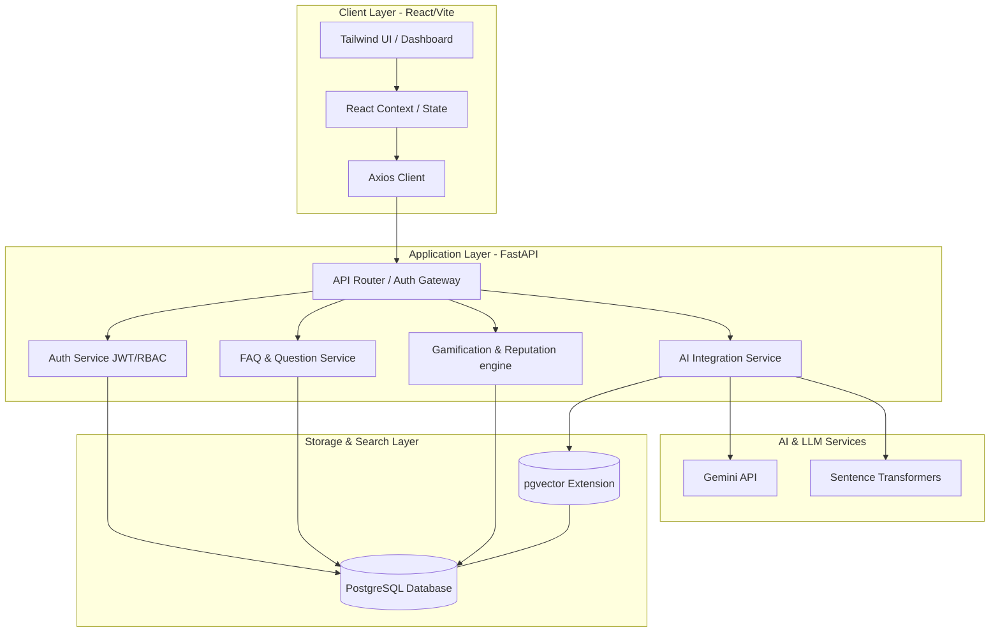

# CrowdFAQ - AI-Powered Community FAQ & Knowledge Sharing Platform

CrowdFAQ is a modern, community-driven knowledge-sharing platform where users ask questions, contribute answers, search existing discussions, and receive AI-assisted support. The platform is designed to eliminate repetitive questions, preserve tribal knowledge, and provide verified, searchable, and reliable information for colleges, internship guidance, company knowledge bases, customer support communities, and technical discussion forums.

---

## 1. High-Level System Architecture

CrowdFAQ utilizes a decoupled multi-tier architecture designed for scalability, low latency, and modular development.



---

## 2. Platform Specifications & Core Modules

### 2.1 User Roles & Access Control (RBAC)

| Role | Permissions | Badge |
| :--- | :--- | :--- |
| **Normal User** | Register, login, ask/answer questions, edit own content, vote, comment, follow questions, view profile. | None (Reputation-based) |
| **Expert** | Normal User permissions + verify answers, mark recommended answers, moderate content. | Blue Badge (Expert) / Red Badge (Faculty) |
| **Moderator** | Expert permissions + remove spam, merge duplicate questions, review flags/reports, suspend content. | Blue Badge |
| **Admin** | Full system permissions, manage users/roles, manage categories, handle reports, access analytics, configure AI parameters. | Gold Badge |

### 2.2 Core Modules (MVP)
1. **Authentication & Authorization**: JWT token-based authentication, password hashing with bcrypt, role-based route guards, password recovery, email verification.
2. **User Profiles**: Display user reputation, earned badges, question/answer history, and activity statistics.
3. **Question Management**: Rich Markdown editor, categories, tags, attachment support (PNG, JPG, PDF), questions following, and editing history.
4. **Answer Management**: Rich answers support, nested replies (comments), and author-selected or expert-verified "Best Answer" flagging.
5. **Voting & Reputation Engine**: Upvoting/downvoting on questions/answers with real-time reputation changes (see Gamification).
6. **Search**: Keyword, tag, and category filters combined with AI Semantic Search.
7. **Report & Moderation System**: Report flag triggers (spam, offensive, wrong info) routed to Moderator dashboard.

### 2.3 Advanced AI Features
* **AI Duplicate Question Detection**: As users type, the system runs semantic distance checks against existing questions. If similarity matches above a threshold (e.g., 0.82), a non-obtrusive modal recommends reading the existing thread first.
* **AI Semantic Search**: Utilizes dense vector embeddings to search questions based on intent rather than pure keyword matching (e.g., matches "how to apply for internships" to "internship application process").
* **AI Answer Summarization**: Leverages the Gemini API to compile summaries of threads with multiple answers.
* **AI Chat Assistant**: An in-app assistant that answers user queries instantly using FAQ databases and vectorized community knowledge.
* **AI Suggested Tags**: Automatically parses titles/descriptions using LLM prompts or entity models to suggest matching tags and categories before posting.
* **AI Related Questions**: "People also asked" recommendations shown on every question detail view.

### 2.4 Gamification System
To drive high-quality contributions, the platform employs a gamified progression model:

* **Reputation Milestones**:
  * Ask a Question: `+5` points
  * Answer a Question: `+10` points
  * Receive an Upvote: `+2` points
  * Answer Marked Verified: `+20` points
  * Answer Selected as Best Answer: `+25` points
* **Badges**:
  * *Beginner Contributor*: Awarded on first approved post.
  * *Top Contributor*: Awarded for maintaining a weekly upvote streak.
  * *Expert Helper*: Awarded when 5 answers are verified.
  * *100 Answers Club*: Awarded when user crosses 100 answers posted.
  * *Community Leader*: Awarded to top-tier reputation holders.

---

## 3. Technology Stack

* **Frontend**: React (with Vite for build tooling), Tailwind CSS (for modern UI utility classes), React Router, Lucide Icons.
* **Backend**: FastAPI (Python), SQLAlchemy (ORM), Alembic (database migrations), Pydantic (data validation).
* **Database**: PostgreSQL (with `pgvector` for storing and query semantic vector embeddings).
* **AI & LLM**: Gemini API (content generation, summarization), Sentence Transformers (`all-MiniLM-L6-v2` or similar model for generating local text embeddings).

---

## 4. Folder Structure & Subdirectories

```
CrowdFAQ/
├── ai/            # AI features (Vectorization, LLM prompts, similarity search)
├── backend/       # FastAPI Backend application (routes, business logic, ORM)
├── database/      # Database migrations, DB schema definitions, seed files
├── docs/          # API specifications, development guides, deployment setup
├── frontend/      # React client codebase (pages, components, assets)
└── testing/       # Automated test suites (unit, integration, end-to-end)
```

For detailed setup and implementation steps for each folder, please refer to the respective sub-README files:
* [Database Blueprint](file:///c:/Users/kkp18/OneDrive/Pictures/Documents/IIT/CrowdFAQ/database/README.md)
* [Backend Blueprint](file:///c:/Users/kkp18/OneDrive/Pictures/Documents/IIT/CrowdFAQ/backend/README.md)
* [AI Blueprint](file:///c:/Users/kkp18/OneDrive/Pictures/Documents/IIT/CrowdFAQ/ai/README.md)
* [Frontend Blueprint](file:///c:/Users/kkp18/OneDrive/Pictures/Documents/IIT/CrowdFAQ/frontend/README.md)
* [Testing Blueprint](file:///c:/Users/kkp18/OneDrive/Pictures/Documents/IIT/CrowdFAQ/testing/README.md)
* [Docs & Guides](file:///c:/Users/kkp18/OneDrive/Pictures/Documents/IIT/CrowdFAQ/docs/README.md)
