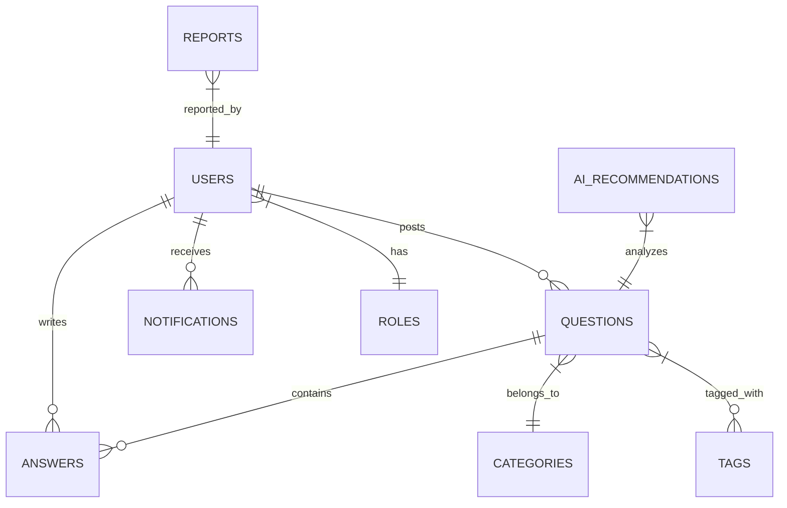

# Database Blueprint (MongoDB & Mongoose)

This document details the database modeling, document schema definitions, collection relationships, index structures, and vector search settings for the **MongoDB** database in CrowdFAQ.

---

## 1. Database Engine & Modeling
* **Database**: MongoDB (v5.0+ or MongoDB Atlas)
* **ODM (Object Document Mapper)**: Mongoose (v6.0+)
* **Index Method**: B-tree (standard indexes) and HNSW (MongoDB Atlas Vector Search)

---

## 2. Collection Relationship Diagram

Since MongoDB is a document-oriented database, we optimize performance by embedding highly relational subdocuments (like comments, votes, and followers) instead of creating separate tables.



---

## 3. Schema Definitions (Mongoose Models)

### 3.1 `Role` (Collection: `roles`)
* `_id` (ObjectId)
* `name` (String, Unique, Required) - 'Admin', 'Moderator', 'Expert', 'User'
* `description` (String)

### 3.2 `User` (Collection: `users`)
* `_id` (ObjectId)
* `role` (ObjectId referencing `Role`, Required)
* `name` (String, Required)
* `email` (String, Unique, Required, Index: true)
* `passwordHash` (String, Required)
* `profilePictureUrl` (String)
* `reputation` (Number, Default: 0)
* `isVerified` (Boolean, Default: false)
* `badges` [Array of Subdocuments]:
  * `badgeId` (ObjectId referencing `Badge`)
  * `awardedAt` (Date, Default: Date.now)
* `createdAt` (Date, Default: Date.now)
* `updatedAt` (Date, Default: Date.now)

### 3.3 `Category` (Collection: `categories`)
* `_id` (ObjectId)
* `name` (String, Unique, Required)
* `slug` (String, Unique, Required, Index: true)
* `description` (String)
* `createdAt` (Date, Default: Date.now)

### 3.4 `Tag` (Collection: `tags`)
* `_id` (ObjectId)
* `name` (String, Unique, Required)
* `slug` (String, Unique, Required, Index: true)

### 3.5 `Question` (Collection: `questions`)
* `_id` (ObjectId)
* `author` (ObjectId referencing `User`, Required, Index: true)
* `category` (ObjectId referencing `Category`, Required, Index: true)
* `title` (String, Required)
* `slug` (String, Unique, Required, Index: true)
* `description` (String, Required)
* `viewsCount` (Number, Default: 0)
* `status` (String, Default: 'open') - 'open', 'resolved', 'locked', 'closed'
* `embedding` (Array of Numbers, Length: 384, Required for Vector Search)
* `tags` [Array of ObjectIds referencing `Tag`]
* `followers` [Array of ObjectIds referencing `User`]
* `votes` [Array of Subdocuments]:
  * `user` (ObjectId referencing `User`)
  * `voteType` (String: 'upvote' | 'downvote')
  * `createdAt` (Date, Default: Date.now)
* `createdAt` (Date, Default: Date.now)
* `updatedAt` (Date, Default: Date.now)

### 3.6 `Answer` (Collection: `answers`)
* `_id` (ObjectId)
* `question` (ObjectId referencing `Question`, Required, Index: true)
* `author` (ObjectId referencing `User`, Required, Index: true)
* `content` (String, Required)
* `isBest` (Boolean, Default: false)
* `isVerified` (Boolean, Default: false)
* `verifiedBy` (ObjectId referencing `User`, Nullable)
* `verificationNotes` (String)
* `verifiedAt` (Date)
* `votes` [Array of Subdocuments]:
  * `user` (ObjectId referencing `User`)
  * `voteType` (String: 'upvote' | 'downvote')
  * `createdAt` (Date, Default: Date.now)
* `comments` [Array of Subdocuments]:
  * `_id` (ObjectId)
  * `author` (ObjectId referencing `User`, Required)
  * `content` (String, Required)
  * `createdAt` (Date, Default: Date.now)
* `createdAt` (Date, Default: Date.now)
* `updatedAt` (Date, Default: Date.now)

### 3.7 `Report` (Collection: `reports`)
* `_id` (ObjectId)
* `reporter` (ObjectId referencing `User`, Required)
* `reportedType` (String, Required) - 'question' | 'answer' | 'comment'
* `targetId` (ObjectId, Required) - Refers to the reported document id
* `reason` (String, Required) - 'spam' | 'offensive' | 'wrong_info'
* `details` (String)
* `status` (String, Default: 'pending') - 'pending' | 'reviewed' | 'dismissed' | 'actioned'
* `createdAt` (Date, Default: Date.now)
* `resolvedAt` (Date)

### 3.8 `Badge` (Collection: `badges`)
* `_id` (ObjectId)
* `name` (String, Unique, Required)
* `description` (String, Required)
* `iconUrl` (String, Required)

### 3.9 `Notification` (Collection: `notifications`)
* `_id` (ObjectId)
* `user` (ObjectId referencing `User`, Required, Index: true)
* `title` (String, Required)
* `content` (String, Required)
* `type` (String, Required) - 'new_answer' | 'upvote' | 'verified' | 'badge_earned'
* `isRead` (Boolean, Default: false)
* `referenceUrl` (String)
* `createdAt` (Date, Default: Date.now)

### 3.10 `AiRecommendation` (Collection: `ai_recommendations`)
* `_id` (ObjectId)
* `question` (ObjectId referencing `Question`, Required)
* `suggestedCategory` (ObjectId referencing `Category`)
* `suggestedTags` (Array of Strings)
* `duplicateQuestion` (ObjectId referencing `Question`)
* `confidenceScore` (Number)
* `createdAt` (Date, Default: Date.now)

---

## 4. MongoDB Atlas Vector Search Index Configuration

To enable semantic search on the `questions` collection embedding path:

1. Create a Vector Search Index on **MongoDB Atlas** named `vector_index`.
2. Configure it with the following JSON configuration:

```json
{
  "mappings": {
    "dynamic": true,
    "fields": {
      "embedding": {
        "dimensions": 384,
        "similarity": "cosine",
        "type": "knnVector"
      }
    }
  }
}
```

---

## 5. Seed Script Guide

To initialize database roles, default categories, and rewards:

Create a seed script at `database/seed.js` using Mongoose:
```javascript
const mongoose = require('mongoose');
// Connect models and run insertMany commands
```
Execute using Node:
```bash
node database/seed.js
```
