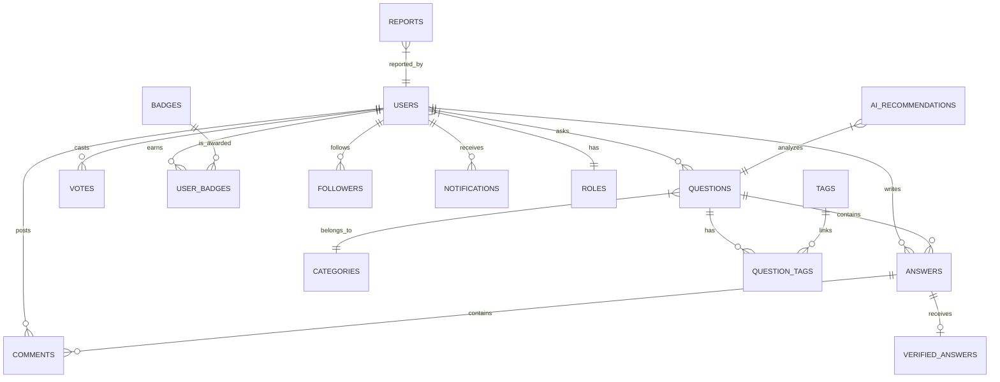

# Database Blueprint

This document details the database schema, entity-relationship diagrams, index optimizations, and migration strategy for CrowdFAQ.

---

## 1. Database Engine & Extensions
* **Database**: PostgreSQL (v14+)
* **Extensions**:
  * `pgvector`: Essential for storing and searching dense vector embeddings (384 dimensions generated by the `all-MiniLM-L6-v2` transformer model).
  * `uuid-ossp`: For UUID primary key generation (if chosen over auto-increment IDs).

---

## 2. Entity-Relationship Diagram



---

## 3. Schema Definitions

### 3.1 `roles`
Stores authorization roles.
* `id` (INTEGER, Primary Key, Auto-increment)
* `name` (VARCHAR(50), Unique, Not Null) - e.g., 'Admin', 'Moderator', 'Expert', 'User'
* `description` (VARCHAR(255))

### 3.2 `users`
Stores user profile, authentication, credentials, and reputation metrics.
* `id` (INTEGER, Primary Key, Auto-increment)
* `role_id` (INTEGER, Foreign Key referencing `roles.id`, Default: User role)
* `name` (VARCHAR(100), Not Null)
* `email` (VARCHAR(150), Unique, Not Null)
* `password_hash` (VARCHAR(255), Not Null)
* `profile_picture_url` (VARCHAR(255), Nullable)
* `reputation` (INTEGER, Default: 0)
* `is_verified` (BOOLEAN, Default: false)
* `created_at` (TIMESTAMP, Default: CURRENT_TIMESTAMP)
* `updated_at` (TIMESTAMP, Default: CURRENT_TIMESTAMP)

### 3.3 `categories`
Categories under which questions can be categorized.
* `id` (INTEGER, Primary Key, Auto-increment)
* `name` (VARCHAR(100), Unique, Not Null) - e.g., 'Admissions', 'Scholarships'
* `slug` (VARCHAR(100), Unique, Not Null)
* `description` (TEXT)
* `created_at` (TIMESTAMP, Default: CURRENT_TIMESTAMP)

### 3.4 `tags`
Keywords linked to questions for quick filtering.
* `id` (INTEGER, Primary Key, Auto-increment)
* `name` (VARCHAR(50), Unique, Not Null)
* `slug` (VARCHAR(50), Unique, Not Null)

### 3.5 `questions`
Contains user-submitted questions with pre-computed semantic embeddings.
* `id` (INTEGER, Primary Key, Auto-increment)
* `author_id` (INTEGER, Foreign Key referencing `users.id`, Not Null)
* `category_id` (INTEGER, Foreign Key referencing `categories.id`, Not Null)
* `title` (VARCHAR(255), Not Null)
* `slug` (VARCHAR(255), Unique, Not Null)
* `description` (TEXT, Not Null)
* `views_count` (INTEGER, Default: 0)
* `status` (VARCHAR(20), Default: 'open') - 'open', 'resolved', 'locked', 'closed'
* `embedding` (VECTOR(384), Nullable) - Vector for semantic similarity checks
* `created_at` (TIMESTAMP, Default: CURRENT_TIMESTAMP)
* `updated_at` (TIMESTAMP, Default: CURRENT_TIMESTAMP)

### 3.6 `answers`
Contains replies to questions.
* `id` (INTEGER, Primary Key, Auto-increment)
* `question_id` (INTEGER, Foreign Key referencing `questions.id` ON DELETE CASCADE, Not Null)
* `author_id` (INTEGER, Foreign Key referencing `users.id`, Not Null)
* `content` (TEXT, Not Null)
* `is_best` (BOOLEAN, Default: false)
* `created_at` (TIMESTAMP, Default: CURRENT_TIMESTAMP)
* `updated_at` (TIMESTAMP, Default: CURRENT_TIMESTAMP)

### 3.7 `comments`
Micro-replies/comments on questions or answers.
* `id` (INTEGER, Primary Key, Auto-increment)
* `question_id` (INTEGER, Foreign Key referencing `questions.id` ON DELETE CASCADE, Nullable)
* `answer_id` (INTEGER, Foreign Key referencing `answers.id` ON DELETE CASCADE, Nullable)
* `author_id` (INTEGER, Foreign Key referencing `users.id`, Not Null)
* `content` (TEXT, Not Null)
* `created_at` (TIMESTAMP, Default: CURRENT_TIMESTAMP)

### 3.8 `votes`
Maintains transparency in voting. Only one vote per user per entity allowed.
* `id` (INTEGER, Primary Key, Auto-increment)
* `user_id` (INTEGER, Foreign Key referencing `users.id`, Not Null)
* `question_id` (INTEGER, Foreign Key referencing `questions.id` ON DELETE CASCADE, Nullable)
* `answer_id` (INTEGER, Foreign Key referencing `answers.id` ON DELETE CASCADE, Nullable)
* `vote_type` (VARCHAR(10), Not Null) - 'upvote' or 'downvote'
* `created_at` (TIMESTAMP, Default: CURRENT_TIMESTAMP)

### 3.9 `question_tags`
Many-to-many relationship mapping between questions and tags.
* `question_id` (INTEGER, Foreign Key referencing `questions.id` ON DELETE CASCADE, Primary Key Part 1)
* `tag_id` (INTEGER, Foreign Key referencing `tags.id` ON DELETE CASCADE, Primary Key Part 2)

### 3.10 `reports`
Moderation report tracking.
* `id` (INTEGER, Primary Key, Auto-increment)
* `reporter_id` (INTEGER, Foreign Key referencing `users.id`, Not Null)
* `reported_type` (VARCHAR(20), Not Null) - 'question', 'answer', 'comment'
* `target_id` (INTEGER, Not Null) - ID of the reported entity
* `reason` (VARCHAR(50), Not Null) - 'spam', 'offensive', 'wrong_info'
* `details` (TEXT, Nullable)
* `status` (VARCHAR(20), Default: 'pending') - 'pending', 'reviewed', 'dismissed', 'actioned'
* `created_at` (TIMESTAMP, Default: CURRENT_TIMESTAMP)
* `resolved_at` (TIMESTAMP, Nullable)

### 3.11 `badges`
Master list of rewards.
* `id` (INTEGER, Primary Key, Auto-increment)
* `name` (VARCHAR(100), Unique, Not Null)
* `description` (TEXT, Not Null)
* `icon_url` (VARCHAR(255), Not Null)

### 3.12 `user_badges`
Tracks badges earned by users.
* `user_id` (INTEGER, Foreign Key referencing `users.id` ON DELETE CASCADE, Primary Key Part 1)
* `badge_id` (INTEGER, Foreign Key referencing `badges.id` ON DELETE CASCADE, Primary Key Part 2)
* `awarded_at` (TIMESTAMP, Default: CURRENT_TIMESTAMP)

### 3.13 `notifications`
In-app notifications feed.
* `id` (INTEGER, Primary Key, Auto-increment)
* `user_id` (INTEGER, Foreign Key referencing `users.id` ON DELETE CASCADE, Not Null)
* `title` (VARCHAR(150), Not Null)
* `content` (TEXT, Not Null)
* `type` (VARCHAR(50), Not Null) - e.g., 'new_answer', 'upvote', 'verified', 'badge_earned'
* `is_read` (BOOLEAN, Default: false)
* `reference_url` (VARCHAR(255), Nullable)
* `created_at` (TIMESTAMP, Default: CURRENT_TIMESTAMP)

### 3.14 `followers`
Tracks who is following a specific question.
* `user_id` (INTEGER, Foreign Key referencing `users.id` ON DELETE CASCADE, Primary Key Part 1)
* `question_id` (INTEGER, Foreign Key referencing `questions.id` ON DELETE CASCADE, Primary Key Part 2)
* `followed_at` (TIMESTAMP, Default: CURRENT_TIMESTAMP)

### 3.15 `verified_answers`
Tracks answers officially endorsed by Experts or Faculty.
* `id` (INTEGER, Primary Key, Auto-increment)
* `answer_id` (INTEGER, Foreign Key referencing `answers.id` ON DELETE CASCADE, Unique, Not Null)
* `verifier_id` (INTEGER, Foreign Key referencing `users.id`, Not Null)
* `notes` (TEXT, Nullable)
* `verified_at` (TIMESTAMP, Default: CURRENT_TIMESTAMP)

### 3.16 `ai_recommendations`
Stores logs of AI operations for audits and diagnostics.
* `id` (INTEGER, Primary Key, Auto-increment)
* `question_id` (INTEGER, Foreign Key referencing `questions.id` ON DELETE CASCADE, Not Null)
* `suggested_category_id` (INTEGER, Foreign Key referencing `categories.id` ON DELETE SET NULL, Nullable)
* `suggested_tags` (JSON, Nullable) - Suggested tags output by AI
* `duplicate_question_id` (INTEGER, Foreign Key referencing `questions.id` ON DELETE SET NULL, Nullable)
* `confidence_score` (FLOAT, Nullable)
* `created_at` (TIMESTAMP, Default: CURRENT_TIMESTAMP)

---

## 4. Key Performance Optimizations & Indices

1. **Vector Index**: 
   Create an HNSW index on the `questions` table embedding column to perform semantic similarity query speeds of <50ms:
   ```sql
   CREATE INDEX IF NOT EXISTS questions_embedding_hnsw_idx 
   ON questions USING hnsw (embedding vector_cosine_ops);
   ```
2. **Text Search Index**: 
   GIN (Generalized Inverted Index) for full-text search on question titles & descriptions:
   ```sql
   CREATE INDEX questions_search_gin_idx ON questions USING gin (to_tsvector('english', title || ' ' || description));
   ```
3. **Voting Uniqueness Constraint**:
   Ensure users can only cast one vote per question/answer:
   ```sql
   ALTER TABLE votes ADD CONSTRAINT votes_user_question_unique UNIQUE (user_id, question_id);
   ALTER TABLE votes ADD CONSTRAINT votes_user_answer_unique UNIQUE (user_id, answer_id);
   ```
4. **Foreign Key Indices**:
   Create indexes on frequently joined fields to speed up queries:
   * `CREATE INDEX idx_questions_author ON questions(author_id);`
   * `CREATE INDEX idx_answers_question ON answers(question_id);`
   * `CREATE INDEX idx_comments_answer ON comments(answer_id);`

---

## 5. DB Migration Guide (Alembic Setup)

When launching the backend, run the following steps to initialize database models:

1. **Activate the backend virtual environment** and configure `DATABASE_URL` in `.env`.
2. **Initialize migrations**:
   ```bash
   alembic init migrations
   ```
3. **Generate automatic migration scripts** based on SQLAlchemy models:
   ```bash
   alembic revision --autogenerate -m "initial_schema"
   ```
4. **Apply changes**:
   ```bash
   alembic upgrade head
   ```
