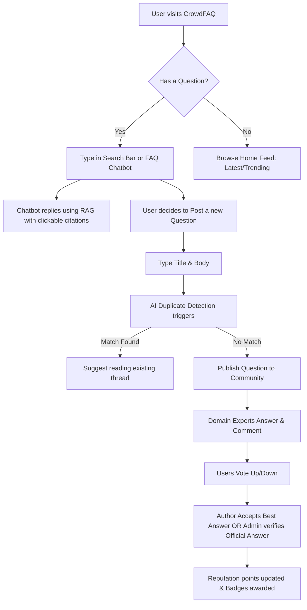
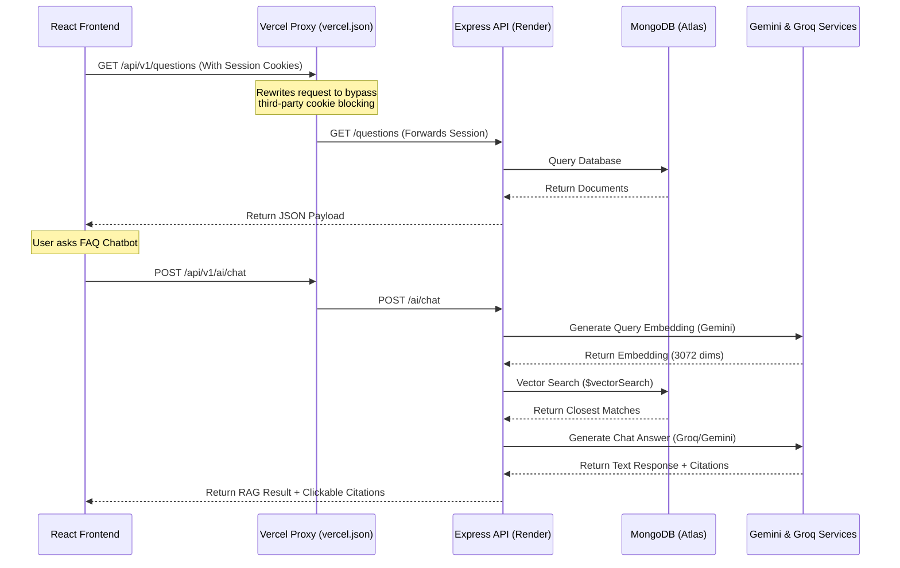

# CrowdFAQ - Comprehensive Product & Project Documentation

CrowdFAQ is a crowdsourced FAQ and community Q&A portal designed to streamline developer support, reduce redundant questions, and capture collective knowledge. It combines a React TypeScript frontend, an Express API, MongoDB, and Gemini-powered vector search.

---

## 1. Product Vision, Goals & What It Solves

Every growing technical community or engineering team suffers from **support fatigue**—answering the same questions (e.g., *"How do we rotate AWS keys without downtime?"*, *"How do I configure my local database?"*) repeatedly across Slack, emails, or chat threads. 

CrowdFAQ solves this by:
*   **Centralizing Knowledge**: Reduces repeated support work by providing a single public/private repository of high-fidelity, verified Q&As and FAQs.
*   **Empowering the Community**: Gamifying knowledge sharing so users ask, answer, and moderate content together.
*   **Integrating Smart AI**: Surfacing answers proactively using vector-based semantic search and an interactive RAG assistant.
*   **Verifying Authority**: Allowing domain experts, faculty, and admins to lock and mark official verified answers.

---

## 2. Target Personas

### 👤 Standard Community Member (The Seeker)
*   **Goal**: Find high-quality answers to technical or platform-related questions instantly.
*   **Pain Point**: Frustrated by search engines that match exact keywords rather than semantic intent, leading to duplicate posts or outdated answers.
*   **Key Action**: Queries the Q&A database, interacts with the FAQ chatbot, votes on helpful answers, and flags spam.

### 🏆 Domain Expert / Active Contributor (The Helper)
*   **Goal**: Build professional reputation, share expertise, and help peers.
*   **Pain Point**: Contributions in chat apps (like Slack) are transient and quickly buried.
*   **Key Action**: Answers open questions, writes detailed long-form answers, and earns badges for their achievements.

### 🛡️ Moderator & Admin (The Curator)
*   **Goal**: Maintain content quality, verify official replies, and remove malicious or incorrect posts.
*   **Pain Point**: Manual moderation of duplicate threads and spam takes too much time.
*   **Key Action**: Views stats, changes user roles, approves/rejects content reports, and marks answers as "Official."

---

## 3. Core Product Features

### 👤 Authentication & User Management
*   **Secure Session Handling**: Uses JWT token authentication transmitted via secure, HTTP-Only cookies to protect endpoints.
*   **Registration & Log In**: Standard forms with client-side validation, registering using valid university emails, hashing passwords via bcrypt.
*   **Profile Customization**: Public profiles displaying user biography, activity metrics (question and answer count), reputation, and dynamically awarded badges, with support for profile picture uploads.

### ❓ Question & Answer Threading
*   **Question Publishing**: Users can create questions by specifying a title, markdown-formatted body description, tags, and category selection.
*   **Answer Contributions**: Markdown supported text input allowing users to contribute answers to active question threads.
*   **Voting System**: Interactive upvote and downvote actions for both questions and answers to dynamically bubble up high-quality content.
*   **Best Answer Selection**: Question authors can select the single "Best Answer" to their questions, pinning it to the top with visual highlights and reputation boosts.
*   **Faculty/Expert Verification**: Faculty members or designated experts can review and endorse answers with special verified status and notes, which renders an official checkmark and a blue border on the UI.

### 💬 Thread Discussions & Collapsible Comments
*   **Nested Discussion Comments**: Users can comment on both questions and answers to request clarifications or discuss details.
*   **Collapsible Comments Toggle**: Comments are collapsed by default to prevent visual clutter in long threads, and can be expanded via a "Show Comments" toggle button.
*   **Content Flagging & Report Logs**: Allows community members to flag spam, inappropriate language, or policy breaches, dynamically queuing the posts in the moderator panel.

### 🤖 AI Integration & Assistance
*   **Smart Duplicate Checker**: Automatically triggers when a user types a new question title (debounced by 500ms), matching it against existing questions via vector similarity. If potential duplicates are found, it lists them in a Warning Modal to prevent duplicate clutter.
*   **FAQ RAG Chatbot (RAG Engine)**: A persistent chatbot widget styled with a premium green-slate aesthetic, using Gemini vector embeddings and MongoDB Atlas Vector Search to retrieve relevant documents and generate concise answers.
*   **Clickable Chatbot Citations**: Inline citations (e.g. `[Source 1]`) in the chatbot response that link directly to the source question slug (`/q/:slug`).
*   **AI-Generated Thread Summarization**: Features an "AI Summary Card" on the question detail page that retrieves and summarizes all posted answers to provide a quick context overview.

### 🔔 Notifications & Subscriptions
*   **Real-time Alerts (Socket.IO)**: Socket-driven real-time notifications pushed to active clients when a new answer is posted to a followed question, an answer is marked best, an answer is verified by faculty, or a post's moderation status is updated.
*   **Notification Inbox**: A central control panel (`/notifications`) displaying read/unread notification history, allowing users to clear or mark notifications as read.
*   **Question Following & Bookmarks**: Users can follow threads for notification updates or bookmark them to pin to active dashboard feeds.

### 🎮 Gamification, Reputation & Badges
*   **Dynamic Reputation System**: Automatically recalculates and updates reputation scores based on upvotes, accepted answers, and badges earned.
*   **Automatically Awarded Badges**: Scored and updated dynamically when user profiles are retrieved, granting:
    *   *Early Adopter*: Assigned if the user is among the first 1,000 members created.
    *   *Storyteller*: Earned by contributing a detailed, comprehensive answer of over 500 words.
    *   *Curator*: Assigned for editing or moderating substantial platform content.
    *   *Mentor*: Earned for contributing 50+ answers.
    *   *Sleuth*: Earned for resolving 5+ reported moderation issues.
    *   *founder*: Automatically granted to accounts with the `admin` role.
    *   *verified*: Automatically granted to accounts designated as verified system or faculty accounts.

### 🛡️ Moderation Console & Administration
*   **Analytics Reports**: Admin/Moderator dashboard displaying real-time platform statistics, active members, and report volumes.
*   **Flag Resolution**: Moderation workflow to review, dismiss, action (delete/edit), and resolve reported posts with system notes.
*   **Role Management**: Admins can change user roles (e.g., from `User` to `Moderator` or `Expert`) directly on the UI.
*   **Category CRUD Management**: Allows moderators to create, edit, or delete categories (e.g., "Academics", "Housing") to organize content.

---

## 4. Team Organization & Scope of Work

The engineering team is split into three main sub-teams, operating with clear interfaces:

| Sub-Team | Focus Area | Key Responsibilities | Primary Code Location |
| :--- | :--- | :--- | :--- |
| **Team A**<br>(Frontend) | Client Interface | React components, TypeScript integration, layout styling, analytics charts. | `/frontend` |
| **Team B**<br>(Backend) | Core API & DB | User sessions, CRUD endpoints, moderation API, Socket.IO config, Mongoose schemas. | `/backend` |
| **Team C**<br>(AI & QA) | Smart Tools & Tests | Gemini embedding scripts, Groq RAG pipelines, duplicate detection algorithms, Jest test suites. | `/backend/services`, `/backend/tests`, `/backend/scripts` |

---

## 5. System Diagrams & Workflows

### User Interaction Flow


### Technical Architecture & Data Flow


---

## 6. Technical Architecture & Integration Details

### 🔑 Security & Cookie Exchange
Session tokens (JWT) are stored in secure, HTTP-only cookies. To prevent cross-site cookie blocking in production, frontend calls are proxied under the same domain (see [Invariant #2](#2-cookie-authentication--reverse-proxying)).

### 🌐 API Endpoint Outline
All request paths use the `/api/v1` prefix:
*   **Authentication (`/auth`)**: `POST /auth/register` (signup), `POST /auth/login` (login), `GET /auth/me` (session recovery/badge sync).
*   **Questions (`/questions`)**: `GET /questions` (feed/category/tags), `POST /questions` (submit), `GET /questions/:slug` (details/slug lookups), `POST /questions/:id/follow` (subscription toggle).
*   **Answers & Votes (`/answers`, `/votes`)**: `POST /answers/:questionId` (submit answer), `POST /answers/:id/best` (select best), `POST /answers/:id/verify` (faculty verification), `POST /votes/questions/:id` & `POST /votes/answers/:id` (voting).
*   **Comments & Reports (`/comments`, `/reports`)**: `POST /questions/:id/comments` & `POST /answers/:id/comments` (submit comments), `POST /reports` (flag content).
*   **Notifications (`/notifications`)**: `GET /notifications` (retrieve), `PATCH /notifications/:id/read` (mark read).
*   **Admin Console (`/admin`)**: `GET /admin/stats` (analytics), `GET /admin/reports` (reported logs), `PATCH /admin/reports/:id` (approve/reject flags), `PUT /admin/users/:id/role` (role management).

### 🔌 Socket.IO Real-Time Event Bridge
The system bridges internal Mongoose events (via controllers) to Socket.IO connections (configured under `backend/config/socket.js` and `backend/server.js`):
*   `answer:created` ──► `new_answer` (Fires to question followers).
*   `answer:best` ──► `answer_accepted` (Notifies answer author).
*   `answer:verified` ──► `official_answer_created` (Announces faculty verified answer).
*   `question:moderated` ──► `question_status_updated` (Triggers status updates across active feeds).
*   **Client Connection**: Frontend establishes connections using `socket.io-client` pointing to the reverse-proxied host URL.

### 🛡️ Route Access Protection
*   **ProtectedRoute**: Wrap pages requiring auth (`Home`, `UserProfile`, `AskQuestion`, `Notifications`). Checks user context in React.
*   **Role-Based Access (Admin/Moderator)**: Access to `/admin/*` dashboards checks the `role` attribute inside `AuthContext`. Non-privileged users (role `'User'` or `'student'`) are blocked and redirected with a toast warning.

---

## 7. Technology Stack & Project Structure

### Frontend Stack
- **React 19 (TypeScript)**, **Craco** (CRA config override)
- **Tailwind CSS & Tailwind Animate**, **Radix UI Primitives**, **Framer Motion**
- **Axios** (configured with global credentials handling)
- **React Hook Form & Zod**, **Recharts** (visualization)
- **Socket.IO Client** (real-time notifications)

### Backend Stack
- **Node.js & Express**, **MongoDB with Mongoose**
- **JWT Authentication** (HTTP-Only secure cookies)
- **Socket.IO** (real-time communication)
- **Gemini API & Groq SDK** (Gemini for 3072-dimensional vector search embeddings, Groq for fast RAG chat generation)

### Project Structure
```text
CrowdFAQ/
  backend/      Express API, controllers, routes, schemas, and seeding scripts
  frontend/     TypeScript React application, Craco configuration, and Tailwind design system
  database/     Database-related project files and backup assets
  docs/         Technical specifications, team guides, testing plans, and moderation API notes
```

---

## 8. Development Setup & Commands

### Prerequisites
- **Node.js 18** or newer
- **npm** or **Yarn**
- **MongoDB** running locally or a MongoDB Atlas connection string
- **Gemini API Key** (required for vector embeddings)
- **Groq API Key** (optional, for fast RAG chat generation)

### Quick Start Setup
1. **Backend**:
   ```bash
   cd backend && npm install
   # Create backend/.env with MONGODB_URI, JWT_SECRET, PORT=5000, GEMINI_API_KEY, and GROQ_API_KEY
   ```
2. **Frontend**:
   ```bash
   cd frontend && npm install --legacy-peer-deps
   ```
3. **Database & Knowledge Seeding**:
   ```bash
   cd backend
   node seed.js                  # Seeds mock Q&As
   node scripts/seedKnowledge.js # Seeds knowledge base vector embeddings
   ```

### Execution & Testing Commands

| Action | Backend Command (in `/backend`) | Frontend Command (in `/frontend`) | Details |
| :--- | :--- | :--- | :--- |
| **Development** | `npm run dev` | `npm start` | Runs local dev servers (Port 5000 / Port 3000) |
| **Production Build** | `npm start` | `npm run build` | Starts production backend / builds static assets |
| **Run Tests** | `npm test` | `npm test` | Runs test suites (bypasses DB in offline tests) |
| **Type Check** | — | `npx tsc --noEmit` | Validates TypeScript compilation |

---

## 9. Codebase & System Invariants

To keep the codebase stable and prevent deployment regressions, developers must adhere to the following invariants:

### 1. Vector Embedding Dimension (3072)
- **Rule**: The database schema in [Question.js](file:///c:/Users/kkp18/OneDrive/Pictures/Documents/IIT/CrowdFAQ/backend/models/Question.js) validates that any populated `embedding` array must be exactly **3072** elements.
- **Implication**: We use `gemini-embedding-001` which outputs 3072 dimensions. Changing the embedding model requires updating `EMBEDDING_DIMENSIONS` in both the schema validation and the MongoDB Atlas Search Vector index definition.

### 2. Cookie Authentication & Reverse Proxying
- **Rule**: Authentication JWT tokens are transmitted via secure, HTTP-Only cookies. The API client in `frontend/src/lib/api.ts` enforces `withCredentials: true`.
- **Implication**: To prevent modern browsers from blocking third-party cookies during deployment, all backend requests are proxied via `/api/*` on the same domain. The `vercel.json` rewrite configuration must always proxy `/api/:path*` to the backend target url.

### 3. TypeScript Compilation & Primitive Typing
- **Rule**: The frontend uses strict React 19 + TypeScript checks.
- **Implication**: Overrides and type augmentations are housed in `frontend/src/react-augmentation.d.ts` and `frontend/src/react-app-env.d.ts` (e.g., merging React's `forwardRef` types). Relaxed types (`any`) on Shadcn/Radix components are preserved to prevent compiler blocking during initial migrations.

### 4. ESLint Hook Check Directives
- **Rule**: In CI/CD pipelines (e.g., Vercel), compiler warnings are treated as hard errors (`CI=true`).
- **Implication**: Any `react-hooks/exhaustive-deps` warning overrides (like `// eslint-disable-next-line react-hooks/exhaustive-deps`) must be placed **directly above** the `useEffect` call declaration.

### 5. Mock-Free State & Views
- **Rule**: Application pages must pull real, dynamic data from the backend APIs rather than mock states.
- **Implication**: Mocks in `mockData.ts` are deprecated. Any newly added pages/components must consume state via the global `AuthContext` or Axios hooks.

### 6. Badges & Testing Connections
- **Rule**: The dynamic badge calculator `calculateAndStoreUserBadges` runs on-demand.
- **Implication**: It contains a safety guard checking `process.env.NODE_ENV === "test"` and Mongoose connection status. Database operations are bypassed during offline unit tests to avoid timeout crashes.

---

## 10. Product Roadmap (Future Scope)

*   **Phase 1 (Completed)**: Core Q&A, comments, flagging/moderation dashboard, dynamic badges, and RAG chatbot with citations.
*   **Phase 2 (Next)**:
    *   **Slack/Discord Integration**: A bot that listens to Slack questions and answers them directly using CrowdFAQ's RAG database.
    *   **Email Digests**: Weekly personalized summaries of trending questions in followed categories.
    *   **Rich Text Editor**: Support for Markdown, syntax highlighting, and code block formatting in question bodies and comments.
